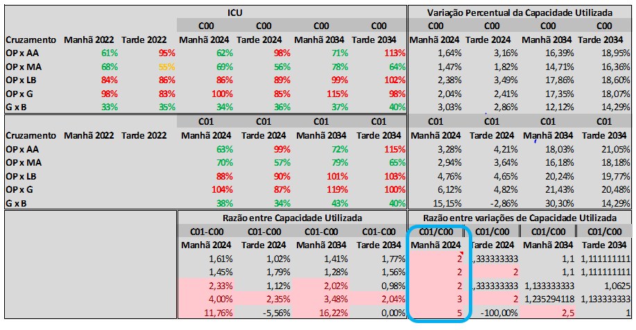

<style >
      body {
        text-align: justify;
        font-size: 2em;
        font-family: Arial;
      }
      titulo{
        text-align: center;
      }
      h1 {
        font-size: 30px;
        text-align: ;
        color: #03045e;
      }
      h2 {
        font-size: 25px;
        text-align: ;
        padding-left: 0.5em;
      }
      h3 {
        font-size: 22px;
        text-align: ;
        padding-left: 1.5em;
      }
      h4 {
        font-size: 18px;
        text-align: ;
        padding-left: 3em;
      }
      h5 {
        font-size: 18px;
        text-align: ;
        padding-left: 4em;
      }
      .main-container {
        max-width: 1800px  !important;
        margin-left: auto;
        margin-right: auto;
      }
      .figure img{
      border-style: dotted !important;
      border-color:#333 !important;
      margin-left: auto;
        margin-right: auto;
      }
      .video-container {
        position: relative;
        padding-bottom: 56.25%; /* 16:9 */
        height: 0;
      }
      .video-container iframe {
        position: absolute;
        top: 0;
        left: 0;
        width: 100%;
        height: 100%;
      }
      </style> 


Polos Geradores de Viagens (PGVs) são empreendimentos com capacidade de geração de volumes expressivos de viagens para deslocamento de pessoas ou cargas. De acordo com o Art. 93 do CTB, empreendimentos de grande porte caracterizados como polos geradores de tráfego somente podem ser aprovados após anuência do órgão ou entidade de trânsito com circunscrição sobre a via (BRASIL, 1997). Durante as etapas de execução e operação de grandes empreendimentos, os diferentes interessados compartilham os mesmos objetivos em relação à segurança e eficiência dos sistemas de transporte e mobilidade urbana, bem como a compatibilidade com a política de desenvolvimento urbano. Nesse sentido, análises de impacto de tráfego conduzidas de forma apropriada podem fornecer uma base factual para suportar decisões acertadas em relação às janelas temporais de mitigação de efeitos gerados por empreendimentos que produzem e/ou atraem viagens e caracterizados como PGVs (DENATRAN, 2001), garantindo a qualidade e segurança dos deslocamentos e seu uso sustentável (ONU, 2019, 2020) por meio de uma distribuição justa e equitativa dos espaços de deslocamento (Licínio Portugal, 2012). 
Dessa maneira, o município e responsáveis pelos PGVs devem promover iniciativas alinhadas que garantam ao cidadão seu direito de ir e vir através de  deslocamentos seguros, e que promovam a qualidade de vida e sustentabilidade (DENATRAN, 2001). Ainda que a municipalidade contribua fornecendo diretrizes, informações e orientações necessárias para elaboração de EIMs, é de responsabilidade do empreendedor a elaboração do EIM e a coleta de dados necessária que caracterizem e descrevam a influência de viagens geradas pelos PGVs no contexto total de viagens nas áreas de influência (DENATRAN, 2001; Licínio Portugal, 2012). Desse modo, os custos incorridos para elaboração do EIM e o ônus de medidas resultantes dos impactos apontados pelo EIM são de responsabilidade do empreendedor (**Plano Diretor**; Art. 56; Parágrafo Único, pag. 67)(DENATRAN, 2001).
Este documento consolida as diretrizes gerais para elaboração de EIMs de empreendimentos em **Nome do Município**, considerando as definições do Manual de Procedimentos para o Tratamento de Polos Geradores de Tráfego (DENATRAN, 2001), e as diretrizes gerais indicadas pelo município de **Nome do Município** em seu **Plano Diretor**. Todo emprendimento que, de acordo com os critérios estabelecidos pela **Secretaria de Mobilidade**, estiverem obrigados a elaborar seu EIM deverão considerar as definições desse documento e solicitar ao órgão de trânsito competente as diretrizes específicas ao emprendimento (caso existam) considerando as peculiaridades do local e do empreendimento.  
No município de **Nome do Município** os projetos objeto de EVU (Estudo de Viabilidade Urbanística) são caracterizados como Projetos Especiais de Impacto Urbano de 1º, 2º e 3º graus de acordo com os artigos 55, 56, 59, 61 e 62 do **Plano Diretor**, sendo aqueles de 2º e 3º em sua maioria empreendimentos com características que requerem a elaboração de EIM.Os EIMs são adotados em casos de implantação, expansão ou mudança das finalidades de uso de PGVs etais estudos devem considerar valores de referência mínimos de viagens geradas por hora pico para que se defina o impacto dos mesmos. 
Dessa forma EIMs requerem técnicas de previsão de demandas e análise de capacidade do sistema para suportar tais condições. Por meio de tais analises e previsões os EIMs devem avaliar a intensificação de congestionamentos (aumento dos tempos de deslocamento), a deterioração das condições físicas da área de influência (redução de conforto e segurança), os conflitos entre tráfego de passagem e aquele associado ao empreendimento (dificuldade de acesso a certas áreas), a demanda por áreas de estacionamento, embarque/desembarque e carga/descarga (DENATRAN, 2001). Também devem ser considerados os impactos sobre o transporte público (**Plano Diretor**; Art. 56.; I, a e Art. 57; V, DENATRAN, 2001 4.2.3, pag.24) e modais alternativos que promovam a sustentabilidade e a segurança dos usuários da via (Licinio Portugal, 2012). 
Os EIMs, enquanto estudos especializados, permitem determinar potenciais impactos gerados por PGV, apontando benefícios gerados a serem maximizados e os impactos negativos considerados como pontos críticos e as possíveis alternativas de resolução dos mesmos (DENATRAN, 2001). Tais estudos respondem questões relacionadas a impactos derivados da implantação de PGVs (Erika Cristine Kneib, 2011), que consideram: 
•	Condições atuais de tráfego
•	Expectativa de condições futuras com e sem a existência do PGV
•	A consideração de modais de maior produtividade social como modais ativos e transporte público
•	Capacidade do modelo atual de mobilidade em atender demandas futuras
•	Necessidades adicionais de mobilidade/acessibilidade que garantam a manutenção do atual Nível de Serviço (NS) para os diferentes modais 
•	Recomendações de melhorias viárias para acomodar demandas futuras de tráfego
As respostas a essas questões contribuem para que a administração pública possa avaliar a conveniência dos PGTs e garantir que tais empreendimentos estejam comprometidos com os interesses coletivos da região. 
Ao solicitar diretrizes para o EIM a ser realizado o empreendedor já deve de antemão fornecer documentos com o plano de edificação, destacando as finalidades de uso, expectativa de geração de viagens e apontamento dos modelos e fatores de cálculo para as estimativas de demanda – valores esses que poderão ser atualizados quando da elaboração do EIM. 
As melhorias a serem executadas não necessariamente dependem apenas de resultados apontados no EIM visando eliminar, mitigar ou compensar os efeitos negativos identificados durante as fases de implantação/operação do empreendimento, tais melhorias também podem ser solicitadas pelo órgão gestor quando houver recomendações de melhorias necessárias à região identificadas em documentos como plano diretor e afins (**Plano Diretor**; Art. 55; § 1º, pag. 66), e ainda, quando houver evidentes assimetrias no uso da estrutura viária no entorno do empreendimento relacionadas à oferta e demanda de vagas de estacionamento, ou uso da capacidade viária frente à demanda gerada pelo PGT conforme a (Tabela 1. Regramento.) (DENATRAN, 2001).
Dessa maneira, responsáveis por PGTs em alinhamento com o órgão gestor de tráfego devem viabilizar os espaços internos necessários para estacionamento, embarque/desembarque e carga e descarga na área interna do empreendimento e garantir a melhor inserção possível do empreendimento na malha viária do município, reduzindo a perturbação no tráfego de passagem e o impacto na vizinhança ao garantir que o empreendimento irá absorver internamente a demanda gerada e tratar os conflitos externos gerados, bem como os problemas de acessibilidade de veículos e pedestres, ao mesmo tempo que assegure operações de carga e descarga em área específica do PGT. 
Os responsáveis pela elaboração de EIMs deverão comprovar habilitação para realização de tais estudos. Neste caso o técnico responsável deverá fornecer documento assinado informando que se responsabiliza pela supervisão do estudo, atestando a veracidade dos dados apresentados – sob pena de responsabilização em caso de má fé na apresentação de dados precários sem a devida menção de qualquer limitação nas informações prestadas. Da mesma forma o órgão competente se compromete em submeter os estudos encaminhados a um corpo técnico habilitado e respaldado para análise de EIMs. 
Embora responsáveis pela elaboração de EIMS e avaliadores de EIMS possuam papeis e objetivos específicos, ambos devem se comprometer em seguir critérios éticos e objetivos na condução de análises e revisões de EIMs visando a obtenção de melhores soluções em segurança, mobilidade, acessibilidade, conforto e preservação do ambiente circundante (**Plano Diretor**; Art. 56; I, a). 
Os EIMs deverão obedecer às normas ABNT de redação e demais exigências aplicadas pelo órgão responsável.  Ainda, todos os dados de estudos, modelagens, cálculos e projetos deverão ser entregues de forma digital em documentos, mapas na escala 1:1000, planilhas, e arquivos DWG e GIS.
As medidas mitigadoras previstas e entregues no Plano Funcional Viário deverão ser suficientes para viabilizar o emprendimento quanto aos aspectos de mobilidade urbana de acorco com o ICU 2003 no horizonte de projeto e 10 anos , de acordo com os seguintes critérios.
•	Nos casos com nível de serviço atual de A a C, todo impacto que apresente um quociente superior a 2 (dois) deverá mitigar ou compensar tais efeitos e em casos em que o quociente for superior a 4 (quatro), deverá obrigatoriamente mitigar os efeitos no local em que foi identificada a variação do nível de serviço. 
•	Nos casos de “A” a “D” que ultrapassem o nível de serviço “D” com o empreendimento, as medidas mitigadoras deverão garantir uma situação em que o nível de serviço não ultrapasse “D”. 
•	Nos casos em que o nível de serviço atual for “D”, e com o empreendimento seja mantido o nível “D”, mas com variação superior a 2 pontos percentuais, deverão ser aplicadas mitigações. 
•	Por fim, naqueles casos com nível de serviço superior a “D” as medidas mitigadoras deverão assegurar no horizonte futuro adotado um nível de serviço igual ao do cenário futuro sem o empreendimento, desse modo variações superiores a 1 ponto percentual no ICU deverão ser mitigadas Tabela 1. 

Conforme o manual do DENATRAN, os impactos na circulação viária resultantes da implantação de PGTs deverão ser analisados sistematicamente e deverão apresentar tratamentos que considerem simultaneamente os efeitos indesejáveis na segurança, mobilidade e acessibilidade de pessoas e veículos. Tão somente após aprovados pelo município os tratamentos mitigatórios e compensatórios adequados relacionados às diretrizes gerais exigidas e aquelas condições específicas relacionadas ao empreendimento em questão (dada por meio de diretrizes específicas), o processo administrativo enquanto parecer técnico de anuência para execução de obras, serviços e operação poderá ser concluído (DENATRAN, 2001). 
Caso as condicionantes estabelecidas nas diretrizes não sejam atendidas o EIM será devolvido ao responsável pelo empreendimento para revisão, e tais atualizações se darão em iterações com o órgão responsável pela avaliação de EIMs até que todas as pendências sejam sanadas e o processo administrativo possa então ser concluído. 
Cabe também ressaltar que o EIM constitui parcela das obrigações do responsável pelo empreendimento, uma vez que o EIM é parte do EVU e deverá estar de acordo com as propostas ambientais, arquitetônicas, urbanísticas e viárias (DENATRAN, 2001), previstas no EVU, de modo que toda alteração em qualquer das partes deverá ser compatibilizada,  a fim de fornecer um conjunto único.


<p> &nbsp;</p>

<span style="font-size: 1.5em; font-weight: bold;"> Estrutura de EIMs</span>

<p> &nbsp;</p>

#	 – Identificação do Empreendimento (Item 4.2.2 Denatran 2001)  

## Nome do empreendimento / Razão Social / Nome fantasia   
##	Identificação/Números dos processos que tramitam na PMPA - EU (Expediente Único) e SEI (quando houver)  
##	Atividade (conforme **PlanoDiretor**)   
##	Objeto da proposta (construção, ampliação, modificação de uso, em funcionamento   
##	Apresentar todas as informações contidas na Planilha de Controle e Registro, de acordo com o EVU apresentado  
##	Fase do Licenciamento  
##	Localização  
##	Responsável legal pelo empreendimento  
##	Responsável Técnico pelo empreendimento  
##	Apresentação de responsável técnico pelo EIM com comprovação de habilitação  
##	Cronograma de execução (fases de desenvolvimento – quando houver)  
##	Restrições de circulação geradas durante a execução do empreendimento  
##	Entorno  
###	Características funcionais, geométricas e físicas das vias existentes (sentidos de circulação, movimentos proibidos, numero de faixas de rolamento, regulamentação de estacionamentos, largura de vias e passeios, raios de curva e inclinação)  
###	Localizaçao e programação de semáforos  
###	Pesquisa sobre projetos de modificação do sistema viário de outros polos geradores próximos  
###	Descrição das atividades desenvolvidas ou previstas, / com breve histórico para empreendimentos existentes, caracterizando o perfil de uso do solo no entorno e destacando empreendimentos que possam competir por viagens geradas para a região.  
###	Perfil do empreendimento  
###	Condições existentes, caracterizando o espaço atual	  
###	Dimensões (área construída, área computável, vagas de estacionamento)  
###	Áreas e dados específicos que fazem referência às atividades desenvolvidas no empreendimento, conforme tipologia.  
###	Visão geral do projeto  
###	Projeto do Empreendimento  
###	Horários de operação e picos de demanda  
###	Área construída da edificação  
###	Área de aproveitamento / Área ocupada do terreno  
###	Características socioeconômicas de moradores (para empreendimentos residenciais)    

<p> &nbsp;</p>

# – Análise do projeto sob a ótica Viária (Item 4.2.3 Denatran 2001)

##	Croquis de interseções significativas na área de influência direta 
##	Oferta, dimensionamento e distribuição de vagas de estacionamentos
##	Dimensionamento e distribuição de áreas de carga e descarga
##	Adequação de acessos específicos para veículos de emergência (aplicável a empreendimentos promotores de grandes eventos) (Item 5.2.1 Denatran 2001)
##	Localização dos acessos
###	Explicação geral sobre os acessos
###	Croqui/Figura do empreendimento indicando o local dos acessos de pedestres, veículos leves, veículos de carga, áreas de embarque e desembarque e de veículos de emergência, de serviço, etc  
##	Descrição da circulação e acessibilidade de Pedestres e Transporte Coletivo
##	Descrição da circulação e acessibilidade de Bicicletas
##	Descrição da circulação e acessibilidade de Veículos Leves e Motocicletas
##	Descrição da circulação e acessibilidade de Veículos Pesados
###	Descrição da circulação e acessibilidade de Táxi, Veículos Fretados, Veículos Especiais e Área de Embarque e Desembarque
###	Recuos viários
###	Declividade de rampas
###	Raios de giro nos acessos e vias de circulação internas
###	Vias internas de circulação
###	Cancelas de controle de acesso, caracterizando demanda, tempo de atendimento e área de acumulação (Item 5.2.1 Denatran 2001)
###	Descrição da sinalização das vias de acesso

<p> &nbsp;</p>
#	 – Análise do Espaço Viário (Item 4.2.3 Denatran 2001)

##	Delimitação da Área de Influência Direta (caracterizado pelas vias de acesso e adjacentes)
##	Caracterização do plano diretor para o local – quando houver
##	Principais eixos de ligação à área de influência direta
##	Características físicas da área de influência direta
##	Análise da circulação na área de influência na situação sem o empreendimento
###	Pesquisa de contagem volumétrica de veículos (volumes classificados)
####	Informações sobre a pesquisa realizada e descrição metodológica
####	Identificação da fonte de dados e apresentação de planilhas
####	Croqui apresentando os movimentos encontrados nos picos
####	Identificação dos períodos de pico de tráfego no entorno
####	Identificação das áreas de impacto direto no tráfego local e de passagem
###	Cálculo de Capacidade/nível de serviço da situação atual sem o empreendimento e futura com e sem o empreendimento, com ênfase nas vias de acesso e adjacentes
####	Utilizar metodologia ICU e HCM
##	Análise da circulação na área de influência na situação atual com o empreendimento (e horizonte de 10 anos – considerar expansão demográfica e de novos empreendimentos se for o caso)
###	Aplicação do Modelo 4 Etapas
####	Geração de Viagens
####	Divisão Modal
####	Distribuição das Viagens
####	Alocação das Viagens
###	Apresentação dos fluxos somados da contagem de tráfego e da alocação por pico
###	Apresentação do modelo de expansão de matrizes
###	Cálculo do nível de serviço da situação atual com o empreendimento
####	Utilizar metodologia ICU e HCM
###	Cálculo do nível de serviço da situação futura (horizonte de 10 anos) com o empreendimento
####	Utilizar metodologia ICU e HCM
####	Apresentação do modelo de projeção dos dados
###	Análise comparada nos Níveis de Serviço e Capacidade Viária das principais interseções e acessos
###	Avaliação do carregamento das principais interseções e acessos na hora pico, nos diferentes cenários considerados
#	Análise das condições de oferta de transporte público e privado e das condições de operação considerando a situação atual e futura
###	Análise das condições de circulação de modais alternativos, sobretudo aqueles relacionados à mobilidade ativa
###	Avaliação das condições de acesso e circulação de veículos e pedestres no interior do empreendimento, bem como no entorno, considerando sobretudo as interferências acarretadas ao fluxo de passagem, considerando as condições vigentes de fluidez e segurança
###	Apresentação da matriz de análise de impactos considerando a fase de ocorrência do impacto, efeito sobre o meio, magnitude dos impactos e medidas de mitigação ou reversibilidade


<p> &nbsp;</p>
# Proposição de Medidas (Item 4.2.4 Denatran 2001)  
##	Identificação de problemas (circulação, acessibilidade e segurança) no Projeto e proposições de soluções internas e externas ao empreendimento
##	Apresentação dos impactos de transição modal quando o empreendimento acarretar mudança do perfil de uso do solo
##	Apresentar Projeto de Sinalização, se houver estacionamento
##	Apresentação de Medidas no espaço viário, externo ao empreendimento
###	Proposição de medidas operacionais ou de gerenciamento do tráfego (quando cabível) visando contribuir na melhoria das condições operacionais – sobretudo aqueles PGVs que em função da natureza da atividade realizam eventos de grande porte que possam sobrecarregar o sistema viário, requerendo intervenção direta sobre a operação da via em datas específicas.
###	Medidas a serem tomadas pelo empreendedor para minimizar os impactos causados na malha urbana da cidade pelo empreendimento, tais como:
####	Mudança de sentido de tráfego
####	Implantação e alargamento de vias 
####	Implantação de obras de arte   
####	Implantação de alterações geométricas   
####	Implantação de melhorias de pavimentação  
####	Implantação / manutenção de sinalização horizontal, vertical e semafórica   
####	Ajustes na programação semafórica   
####	Implantação de medidas moderadoras de tráfego   
####	Tratamento para pedestres, ciclistas e pessoas com deficiência ou mobilidade reduzida  
####	Recomendação de implantação de linhas de transporte coletivo, escolar ou áreas para embarque e desembarque ou táxi  
####	Propostas de fomento à transição modal, como oferta de infraestrutura diferenciada para mobilidade sustentável  
####	Proposição de medidas mitigatórias quando da impossibilidade de mitigação completa dos impactos negativos  
####	Plano Funcional Viário como produto final do EIM apresentando projeto básico de todas as intervenções viárias apresentadas para mitigar os impactos do PGV  
####	Outras medidas cabíveis  

<p> &nbsp;</p>

# Medidas Futuras de Segurança Viária (Item 5.1 Denatran 2001)
##	Compromisso de avaliação dos índices de acidentalidade no horizonte de 3 a 5 anos  
##	Compromisso de proposição de medidas de segurança viária quando identificado incremento nos índices de acidentalidade absolutos e UVP superiores à taxa esperada para a região (DENATRAN, 2001, pag 32)


<p> &nbsp;</p>


<span style="font-size: 1.5em; font-weight: bold;"> Informações Adicionais </span>


Projeção do Tráfego de Passagem:  
Para estimar o tráfego futuro sem o empreendimento urbanístico, são utilizadas taxas de crescimento para o tráfego atual. Na falta de informações específicas, adota-se a taxa de 1,5% ao ano, que é um valor recomendado e utilizado para estudos de tráfego na Região Metropolitana de **NomeDoMunicípio** (RMXX).  
A situação futura com projeto é constituída da situação sem projeto acrescida da  demanda na situação com projeto. Com os dois cenários de análise (situação futura sem projeto e com projeto), é feita uma comparação dos níveis de serviço do sistema viário e são estabelecidos os impactos.  
Quando houver dados atualizados, oriundos de fontes de dados oficiais, o responsável pelo estudo poderá sugerir para avaliação um cálculo de projeção que julgue adequado, apresentando os dados e o modelo matemático adotado. Após análise, a **SecretariaMobilidadeXX** indicará se a proposta é aceitável ou se a projeção de 1,5% deve ser mantida.  

<p> &nbsp;</p>

<span style="font-size: 1.5em; font-weight: bold;"> Medidas Compensátórias </span>

Atualmente a **SecretariaMobilidadeXX** considera no entorno imediato todas as interseçõs como nível **D**. Nesse caso, empreendimentos com interseções em níveis **A**, **B** ou **C** podem acumular demanda utilizando a capacidade atual desde que não extrapolem o nível **D**, ou seja, um intervalo correspondente à 68% da capacidade. Esse modelo é bastante permissivo para empreendimentos instalados em regiões com boas condições de fluidez, ao mesmo tempo que é restritivo para aqueles casos com níveis de serviço acima de **D**, já que estes devem garantir a manutenção no nível de serviço pré-existente.  


<span style="font-size: 1.2em; font-weight: bold;"> Critérios</span>

Diante disso, a proposta é de adotar a avaliação dos níveis de serviço de **A** a **C** a partir do quociente entre a variação do ICU sem projeto e a variação do ICU com projeto, nos horizontes de inauguração do empreendimento e futuro (10 anos) desde que tais níveis não alcancem o nível **D**. 
Desse modo: 

* Nos casos com nível de serviço atual de **A** a **C**em que o quociente for superior a 4 (quatro), deverá obrigatoriamente mitigar os efeitos no local em que foi identificada a variação do nível de serviço.    
* Nos casos de **A** a **D** que ultrapassem o nível de serviço **D** com o empreendimento, as medidas mitigadoras deverão garantir uma situação em que o nível de serviço não ultrapasse **D**. 
* Nos casos em que o nível de serviço atual for **D**, e com o empreendimento seja mantido o nível **D**, mas com variação superior a 2 pontos percentuais, deverão ser aplicadas mitigações.   
* Por fim, naqueles casos com nível de serviço superior a **D** as medidas mitigadoras deverão assegurar no horizonte futuro adotado um nível de serviço igual ao do cenário futuro sem o empreendimento, desse modo variações superiores a 1 ponto percentual no ICU deverão ser mitigadas Tabela 1. A Figura 1 ilustra uma situação em que para aqueles cenários com ICU entre **A** e **C**, a regra da variação possa ser adotada.  


```{r, echo=FALSE, warning=FALSE, message=FALSE, error=FALSE, fig.width=12, fig.align='center'}
library(readxl)
library(xtable)
library(knitr)
library(kableExtra)
library(tidyverse)
dados= read_excel("DadosEIM.xlsx", sheet = 1) 
kable(dados, caption = "Tabela 1. Regramento para compensações/mitigações.")
```

Os valores exibidos na Tabela 1 foram obtidos de um cenário real demonstrado na Figura 1.

Figura 1. Cenários reais ICU.  
```{r , echo=FALSE, fig.cap="", out.width = '100%', message=FALSE}

```


<br>
<span style="font-size: 1.2em; font-weight: bold;"> Justificativa</span>

Justificativa: As vias são projetadas em um horizonte de projeto de 25 a 30 anos, assim, tais vias são projetadas para capacidades que consideram o crescimento natural da demanda para o período que compõe o horizonte de projeto. Dessa maneira, quando um empreendimento gera uma alavancagem no crescimento que constitui o dobro do crescimento da demanda natural (quociente 2), isso faz com que a vida útil da instalação seja abreviada.  
<br>
Conforme ilustrado na Tabela 2, a coluna crescimento natural considera um crescimento no volume de 1,5% ao ano; já a coluna crescimento com emprendimento apresenta a composição do crescimento natural da demanda acrescida de um crescimento gerado pelo empreendimento totalizando um crescimento da ordem de 2,65% ao ano. 
<br>
No cenário que considera apenas o crescimento natural a capacidade da instalação atenderia a demanda pelos 25 anos de projeto, sendo superada apenas no 26º ano; no cenário com crescimento da demanda gerada com o empreendimento, a capacidade da demanda de projeto seria atendida até o 14º ano apenas, abreviando a vida útil de projeto em 11 anos.

```{r , echo=FALSE, fig.cap="", out.width = '100%', message=FALSE}
dados= read_excel("DadosEIM.xlsx", sheet = 2) 
dados = dados[, 1:3]
dados$`Crescimento Natural` = as.integer(dados$`Crescimento Natural`)
dados$`Crescimento com Empreendimento` = as.integer(dados$`Crescimento com Empreendimento`)
dados = dados %>%
    mutate(bg = if_else(dados$`Crescimento com Empreendimento` < 1600, 1, 0),
           bg2 = if_else(dados$`Crescimento Natural` < 1600, 1, 0))
dados[, ] %>%
  mutate(`Crescimento com Empreendimento` = cell_spec(`Crescimento com Empreendimento`, color = "white", bold = T,
                      background = ifelse(bg == 0, "#c1121f", "#4361ee"))) %>%
  mutate(`Crescimento Natural` = cell_spec(`Crescimento Natural`, color = "white", bold = T,
                      background = ifelse(bg2 == 0, "#c1121f", "#4361ee"))) %>%
     dplyr::select(-bg, -bg2) %>%
  kable(escape = F, , caption = "Tabela 2. Evolução da Demamda até a capacidade de projeto de 1600 veiculos/hora.") %>% 
  kable_styling()

```


<span style="font-size: 1.5em; font-weight: bold;"> Área de Influência </span>

```{r, echo=FALSE, warning=FALSE, message=FALSE, error=FALSE, fig.width=12, fig.align='center'}

dados= read_excel("DadosEIM.xlsx", sheet = 3) 
dados$Local = replace_na(data = dados$Local, replace = "")
dados$AID = replace_na(data = dados$AID, replace = "")
dados$AII = replace_na(data = dados$AII, replace = "")
dados$Referência = replace_na(data = dados$Referência, replace = "")
kable(dados, caption = paste("Tabela 3. Áreas de Influencia Direta e Indireta em", nrow(dados), "cidades"))
```


<p> &nbsp;</p>
<span style="font-size: 1.5em; font-weight: bold;"> Bibliografia:</span>
<p>
Albert. (2018) Transportation Impact Assessment Guidelines. Albert. Obtido de https://stalbert.ca/site/assets/files/6500/pd_transportation-impact-assessment.pdf  

Araxá. (2016) Manual para elaboração do relatório de impacto no trânsito urbano. Araxá. Obtido de http://ipdsa.org.br/dados/link/140/arquivo/MANUAL_RITU_SETEMBRO_2016.pdf  

Arroyo Grande. (2021) Multimodal Transportation Impact Study Guidelines. Arroyo Grande. Obtido de file:///C:/Users/fsmoura/OneDrive/EngenhariaDeTrafego/EIT/Guidelines/ArroioGrande-California.pdf  

Aspen. ([s.d.]) Transportation Impact Analysis Guidelines. Aspen, Aspen.  

Austin. (2022) Transportation Impact Analysis Guidelines. Austin. Obtido de https://www.austintexas.gov/sites/default/files/files/Transportation/Transportation_Development_Services/Austin_TIA_Guidelines_06-2022.pdf  

Barueri. (2019) Termo de referência (Roteiro) paa elaboração do relatório de impacto de trânsito completo - RIT. Barueri. Obtido de https://portal.barueri.sp.gov.br/arquivos/sites/SEURB/TERMO DE REFERÊNCIA_TRÂNSITOCOMPLETO-RIT.pdf  

Bragança Paulista. (2016) Estudo de Impacto de Vizinhança e Relatório de Impacto de Vizinhança. Bragança Paulista. Obtido de https://www.caubr.gov.br/wp-content/uploads/2017/10/CAPACIDADES4.pdf  

Brasil. (2018) Lei no 13.614/2018. Obtido 11 de outubro de 2022, de https://legislacao.presidencia.gov.br/atos/?tipo=LEI&numero=13614&ano=2018&ato=e6ao3aq1UeZpWTea1

BRASIL. (1997). Lei 9503. Brasília. Obtido de http://www.planalto.gov.br/ccivil_03/leis/l9503compilado.htm  

BTO. (2021) Traffic impacts Analysis Guidelines. Milwaukee.  

Calgary. (2011) Transportation Impact Assesment (TIA) Guidelines. Calgary. Obtido de https://www.calgary.ca/content/dam/www/transportation/tp/documents/planning/final-transportation-impact-assessment--tia--guidelines.pdf  

CET. (1986) Polos Geradoress de Tráfego. São Paulo. Obtido de http://www.cetsp.com.br/media/65486/bt32- polos geradores de trafego.pdf  

CET. (2000) Polos Geradores de Tráfego II. São Paulo.  

CONTRAN. Resolução 514/2014. (2014). CONTRAN, Brasília. Obtido de http://www.denatran.gov.br/download/Resolucoes/Resolucao5142014.pdf  

Cubatão. (2021) Roteiro Para Elaboração do Relatório de Impacto do Tráfego- RIT. Cubatão. Obtido de https://www.cubatao.sp.gov.br/wp-content/uploads/2021/04/8-RIT-FINAL.pdf  

Cybis, H. B. B., Lindau, L. A., e Araújo, D. R. C. de. (1999) Avaliando o impacto atual e futuro de um pólo gerador de tráfego na dimensão de uma rede viária abrangente. TRANSPORTES, 7(1). doi:10.14295/transportes.v7i1.220 

DENATRAN. (2001) Manual de Procedimentos para o Tratamentos de Polos Geradores de Tráfego.  

DPP. (2018) Manual de Análise de Estudos de Tráfego. Campinas. Obtido de http://www.emdec.com.br/eficiente/repositorio/1SiteNovo/Transito/17599.pdf  

DRI. (2019) Trasnportation Guidance. Cape Cod.  

Dublin. (2021) Transportation Impact analysis Guidelines. Dublin. Obtido de   https://dublin.ca.gov/DocumentCenter/View/28516/Transportation-Impact-Analysis-Guidelines-2021?bidId=

Dunn, R. C., e HAMILTON, G. D. (1971) TRANSPORTATION ENGINEERING DESIGN FOR SHOPPING CENTERS. Traffic Engineering & Control, 13(7).  

Erika Cristine Kneib, Ds. A. S. da S. G. (2011) Análise espaço-temporal da relação entre polos geradores de viagens, centralidades e seus impactos. XXV ANPET (p. 12). ANPET, Belo Horizonte.  

ETTURP. ([s.d.]) Considerações para Elaboraçãode Estudos de Tráfego para aprovação de empreendimentos no município de Ribeirão Preto. Obtido 23 de agosto de 2022, de moz-extension://91812cb9-51dc-4690-9b89-92a008f74d12/enhanced-reader.html?openApp&pdf=https%3A%2F%2Fwww.ribeiraopreto.sp.gov.br%2Fportal%2Fpdf%2Ftranserp546202201.pdf  

FDOT. (2014) Transportation site Impact - handbook - Estimating the Transportation Impacts of Growth. Tallahassee. Obtido de http://www.dot.state.fl.us/planning  

FHWA. (2006) Best Practices for Traffic Impact Studies. Salem.  

Fountain Valley. (2020) Transportation Impact Assessment Guidelines for Land Use Projects in CEQA and for General Plan Consistency. Fountain Valley. Obtido de https://www.fountainvalley.org/DocumentCenter/View/13730/VMT-Guidenliens_City-of-Fountain-Valley  

Grando, L., e Portugal, L. da S. (1986) A interferência dos pólos geradores de tráfego no sistema viário: análise e contribuição metodológica para shopping centers. UFRJ, Rio de janeiro. Obtido de https://buscaintegrada.ufrj.br/Record/aleph-UFR01-000078598

Guarulhos. (2005) Roteiro para elaboração do RIT - Relatório de Impacto no Tráfego. Guarulhos. Obtido de http://servicos.guarulhos.sp.gov.br/01_servicos/central_atend/form_outros/rit_relatorio_impacto_trafego.pdf  

Halton. (2015) Transportation Impact Study (TIS) Guidelines. Halton. Obtido de https://www.halton.ca/Repository/Transportation-Impact-Study-Guidelines

Hidrolandia. (2019) Termo de Referência para EIV. Hidrolandia. Obtido de http://www.camarahidrolandia.go.gov.br/wp-content/uploads/2019/08/Termo-de-Referencia-do-EIV-RIV-anexoII.pdf   

Idaho. (2008) Transportation Impact Studies Recommended Practices. Idaho. Obtido de https://www.compassidaho.org/documents/prodserv/reports/TIS_Sept2008.pdf  

ITE. (1988) Traffic Access and Impact Studies for site development. A summary of a proposed recommended pratice. ITE Journal, 58(8).  

Kansas City. (2022) Traffic Impact Studies. Codes of Ordinances. Obtido 23 de agosto de 2022, de https://library.municode.com/mo/kansas_city/codes/zoning_and_development_code?nodeId=ZODECOKAMI_400_SERIESDEST_88-440TRIMST_88-440-04STAR  

Keefer, L. E. (1966) Urban travel patterns for airports, shopping centers, and industrial plants - Refort 24. Milford. Obtido de https://onlinepubs.trb.org/Onlinepubs/nchrp/nchrp_rpt_24.pdf  

Knoxville-Knox. (2020) Transportation Impact Analysis Guidelines. Knoxville-Knox County. Obtido de https://archive.knoxplanning.org/about/tia_guidelines.pdf  

Lagoa Santa. (2011) Termo de Referência para RIV. Lagoa Santa. Obtido de https://www.lagoasanta.mg.gov.br/mapas/category/188-down-reg-urb?download=4620&start=20  

Lawrence. (2021) Transportation Impact Study Guidelines. Lawrence. Obtido de https://lawrenceks.org/wp-content/uploads/2021/02/Appendix-I-Traffic-Impact-Study-Guidelines.pdf  

London. (2012) Transportation Impact Assesment Guidelines. London.  

Los Angeles. (2020) Transportation Impact Analysis Guidelines. Los angeles. Obtido de https://dpw.lacounty.gov/traffic/docs/Transportation-Impact-Analysis-Guidelines-July-2020-v1.1.pdf  

MARCO. (1994) Shopping Center Itaguaçu – análise socioeconômica. Florianópolis  .

MARTINS, J. A. (1996) Transporte, uso do solo e auto-sustentabilidade. UFRJ.  

Matthews. (2021) Transportation Impact Analysis (TIA) Process and Procedures Manual. Matthews. Obtido de https://www.matthewsnc.gov/files/documents/TIAProcessandProceduresManual20211541114604122021AM.pdf  

Menlo Park. (2020) Trasnportetion Impact Analysis Guidelines. Menlo Park, Menlo Park.

Mussi, C. W., Sachet, S., Canali, R. V, Grando, L., e Salvador, J. L. A. C. E. A. F. L. C. A. (1988) Shopping 
Center Beiramar – Análise socioeconômica. Florianópolis.  

Niagara Region. (2012) Guidelines for Transportation Impact Studies. Thorold. Obtido de https://www.niagararegion.ca/business/pdf/traffic-impact-study-guidelines.pdf  

ONU. (2019) Objetivos de Desenvolvimento Sustentável | As Nações Unidas no Brasil. Obtido 11 de outubro de 2022, de https://brasil.un.org/pt-br/sdgs

ONU. (2020) UN Resolution on Improving Global Road Safety - Global Alliance of NGOs for Road Safety. Obtido 11 de outubro de 2022, de https://www.roadsafetyngos.org/about/about-road-safety/un-resolution-on-improving-global-road-safety/

Passadena. (2022) TRANSPORTATION IMPACT ANALYSIS GUIDELINES. Passadena. Obtido de https://www.cityofpasadena.net/transportation/community-mobility/transportation-impact-review/

Paulinia. (2015) Roteiro para elaboração do estudo de impacto de vizinhança - EIV. Paulinia. Obtido de http://www.paulinia.sp.gov.br/downloads/seddema/RoteiroEIV.pdf  

PDT. (2017) Policies and Procedures for Transportation Impact Studies. Harrisburg. Obtido de https://www.penndot.pa.gov/Doing-Business/Permits/HighwayOccupancyPermits/Documents/Publication 282/Appendix A - 

Policies and Procedures for Transportation Impact Studies.pdf  

Plano. (2022) Plan Zoning Ordinance. Plano. Obtido de https://www.plano.gov/1277/Zoning-Ordinance

Porto Alegre. (2022) Plano de Segurança Viária Sustentável da cidade de Porto Alegre. DOPA. Obtido 11 de outubro de 2022, de https://dopaonlineupload.procempa.com.br/dopaonlineupload/4528_ce_378557_1.pdf

Portugal, L. da S., e Goldner, L. G. (2003) Estudo de Polos Geradores de Tráfego e seus Impactos nos Sistemas Viários de Transportes. (1o ed). Edgard Blücher, São Paulo.  

Portugal, Licinio. (2012) POLOS GERADORES DE VIAGENS ORIENTADOS A QUALIDADE DE VIDA E AMBIENTAL: Modelos e Taxas de Geração de Viagens. (Licínio Portugal, Ed) (1o ed). Editora Interciência, Rio de Janeiro. Obtido de https://www.editorainterciencia.com.br/index.asp?pg=prodDetalhado.asp&idprod=277&token=

Portugal, Licínio. (2012) Polos geradores de viagens orientados a qualidade de vida e ambiantal: Modelos e Taxas de Geração de Voagens. Intercicencia, Rio de Janeiro.  

PP Bureau. (2020) Norwalk Transportation Management Plan. Connecticut Department of Transportation. Obtido 24 de agosto de 2022, de https://portal.ct.gov/DOT/PP_Bureau/Transportation-Studies-Share-this-pages-direct-link-with-a-friend-or-coworker-wwwctgovdotstudies/Norwalk-Transportation-Management-Plan-DOT01020336PE  

Preto, R. (2018) Termo de Referência Básico de EIV. Ribeirão Preto.  

PROTEGER. (2015) Estudo de Tráfego Veicular. Navegantes.  

PWD. (2015) Trasnportation Impact Studies Requirements. Blue Springs.  

PWDESTE. (2009) Traffic Impact Study Guidelines. Hamilton.  

Recife. (2020) Roteiro Básico para Elaboração de Estudo Prévio de Impacto de Vizinhança - EIV. Recife. Obtido de https://conselhodacidade.recife.pe.gov.br/sites/default/files/2020-12/EIV - Roteiro.pdf  

Rio Claro. (2018) Anexo XVI - Roteiro de informações para elaboração de Estudo de Impacto de Vizinhança (EIV) / 
Relatório de Impacto de Vizinhança (RIV). Rio Claro. Obtido de https://www.rioclaro.sp.gov.br/pd/arquivos/2018/AnexoXVI.pdf  

Roca, R. (1980) Market research for shopping centers. Basic Research Procedures. Nova York.  

SANDAG. (2010) Trip Generation for Smart Gowth. San Diego.  

Santo André. (2021) Roteiro para elaboração do Relatório do Impacto no Trânsito – RIT. Santo André. Obtido de https://www3.santoandre.sp.gov.br/portaldotransito/wp-content/uploads/2021/03/Roteiro_RIT.pdf  

São José dos Campos. (2020) anexo V - Manual para elaboração de Relatório de Impacto de Tráfego. São José dos Campos. Obtido de https://www.sjc.sp.gov.br/media/121926/anexo-v_decreto-18519-2020.pdf  

Schvasrberg, B., Martins, G. C., Kallas, L. M. E., Cavalcanti, C. B., e Teixeira, L. M. (2016) Estudo de Impacto de Vizinhançaa: Caderno Técnico de Regulamentação e Implementação. (1o ed). Capacidades, Brasília.  

SCVTA. (2014) Transportation Impact Alalyses Guideline. Santa Clara.  
Sharmeen, N., Sadat, K., Zaman, N., e Mitra, S. (2012) Developing a Generic Methodology for Traffic Impact Assessment of a Mixed Land Use in Dhaka City., 0.  

Silva, G. L. da, e Freitas, I. M. D. P. de. (2011) Um estudo sobre delimitação da área de influência em polos múltiplos geradores de viagens. ANPET (Ed), Anais 15o Congresso da ANTP (p. 2176–87). ANPET, Belo Horizonte. Obtido de http://redpgv.coppe.ufrj.br/index.php/es/produccion/articulos-cientificos/2011-1/564-um-estudo-sobre-delimitacao-da-area-de-influencia-em-polos-multiplos-geradores-de-viagens/file 

Silveira, I. T. (1991) Análise de polos geradores de tráfego segundo sua classificação, área de influência e padrão de viagens. UFRJ. Obtido de https://minerva.ufrj.br/F/?func=direct&doc_number=000173163&local_base=UFR01  

SOARES, M. . (1990) Método para estabelecimento da capacidade de uma rede viária: Aanálise dos efeitos da implantação de pólos geradores de tráfego. UFRJ.  

Taubaté. (2019) Relatório de Impacto de Tráfego - RIT - Roteiro Completo. Taubaté. Obtido de https://www.taubate.sp.gov.br/wp-content/uploads/2019/01/Roteiro-RIT-COMPLETO.pdf  

Toronto. (2003) Guidelines for the Preparation of Transportation Impact Studies. Toronto. Obtido de http://arris.ca/~arris2/ARCHIVE/traffic-impact-study-guidelines.pdf  

Três Corações. (2021) Termo de Referência para desenvolvimento de estudos de impacto de vizinhança. Três Corações.

Urban Land Institute. (1971) The community builders handbook. (ULI, Ed). Washington. Obtido de https://archive.org/details/communitybuilder00urba/page/n1/mode/2up  

VDOT. (2012) Traffic Impact Analysis Regulations. Richmond.  

VDOT. (2014) Updated Administrative Guidelines for the Traffic Impact Analysis Regulations. Richmond.  

Volusia. (2009) Transportaion Impact Analysis (TIA) Guidelines - Methodology For Development Applications. Volusia. Obtido de http://www.r2ctpo.org/wp-content/uploads/TIA-Guidelines-Methodology.pdf  

WSDOT. (2020) Multimodal Transportation Impact Analysis Guideline. Olympia. Obtido de https://wsdot.wa.gov/sites/default/files/2021-04/TrafficOps-WSDOTMultimodalTranspImpactAnalysisGuidelines.pdf  

Yowa Sudas. (2020) Traffic Impact Studies. Ames. Obtido de https://intrans.iastate.edu/app/uploads/sites/15/2020/03/5N-1.pdf  


